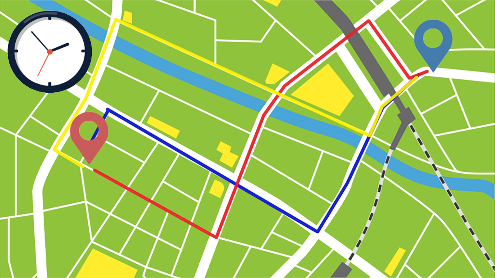
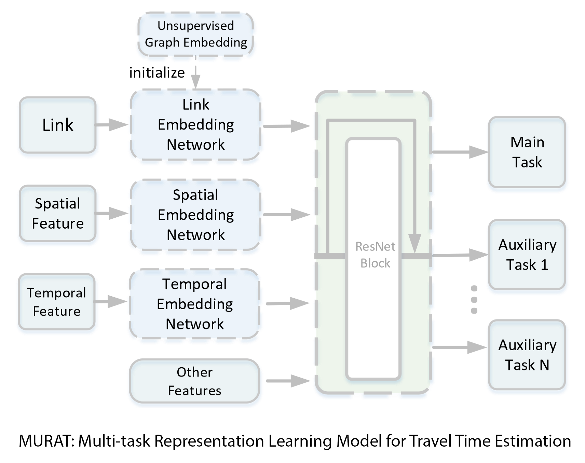
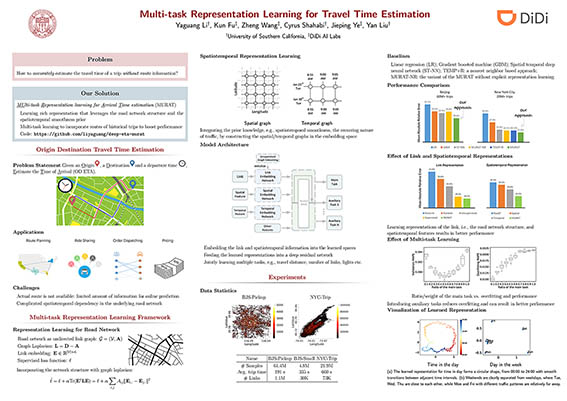

# Multi-task Representation Learning for Travel Time Estimation 
This is a PyTorch implementation of MURAT in the following paper (code is being added ...): \
Yaguang Li, Kun Fu, Zheng Wang, Cyrus Shahabi, Jieping Ye and Yan Liu, [Multi-task Representation Learning for Travel Time Estimation](http://infolab.usc.edu/DocsDemos/kdd_2018_deep_eta.pdf), KDD 2018.




Given an origin, a destination and a departure time, the model want to estimate the time of arrival.

## Model Architecture



## Poster


## Requirements
- scipy>=0.19.0
- numpy>=1.12.1
- pandas>=0.19.2
- pytorch>=0.3.0
- pyaml


Dependency can be installed using the following command:
```bash
pip install -r requirements.txt
```


## Train the Model
```bash
```

More details are being added ...

## Citation

If you find this repository useful in your research, please cite the following paper:
```
@inproceedings{li2018kdd_deep_eta,
  title={Multi-task Representation Learning for Travel Time Estimation}
  author={Li, Yaguang and Fu, Kun and Wang, Zheng and Shahabi, Cyrus and Ye, Jieping and Liu, Yan},
  booktitle={International Conference on Knowledge Discovery and Data Mining (KDD '18)},
  year={2018}
}
```